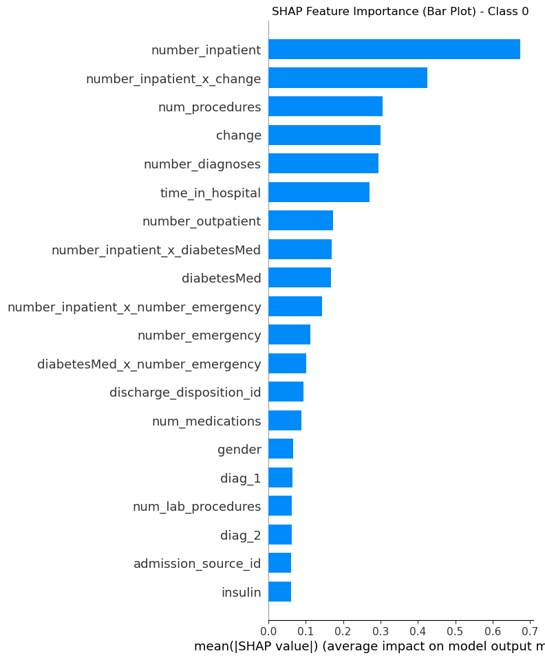
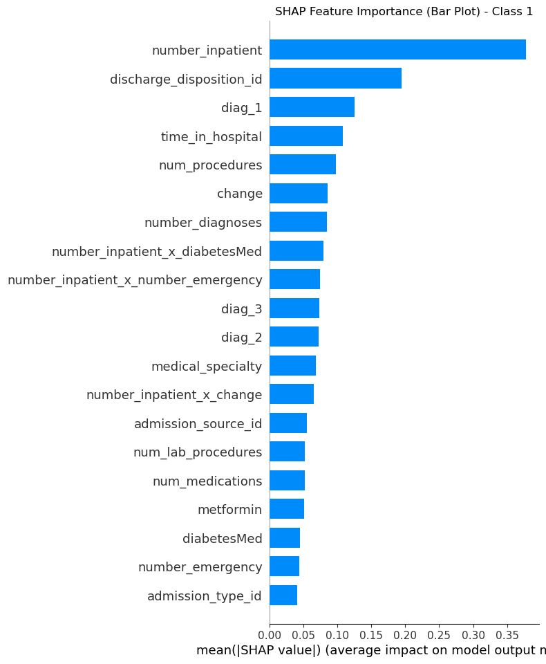
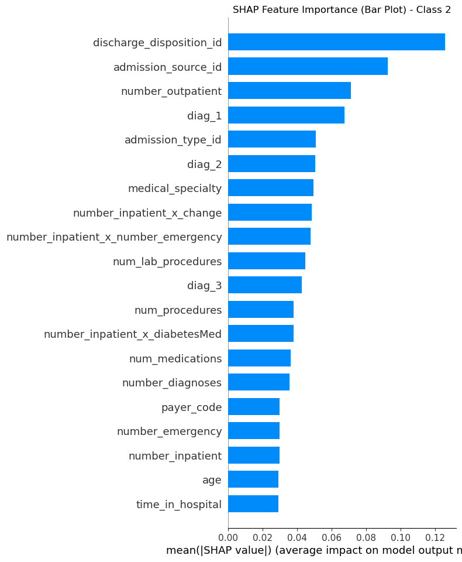
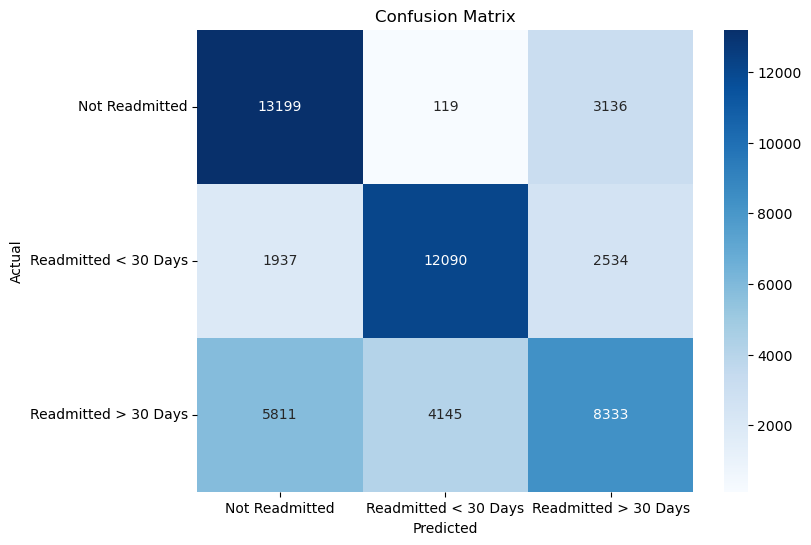

# `Diabetes Readmission Analysis`

The `diabetes_readmission` repository provides a comprehensive analysis and modeling pipeline for predicting hospital readmission among diabetic patients. Using freely available clinical data from the [Diabetes 130-US Hospitals dataset (1999-2008)](https://archive.ics.uci.edu/dataset/296/diabetes+130-us+hospitals+for+years+1999-2008), the goal is to predict whether a patient will be readmitted within three specific categories:
- **Class 0**: No readmission within 30 days.
- **Class 1**: Readmitted within 30 days.
- **Class 2**: Readmitted after more than 30 days.

This dataset represents ten years of clinical care across 130 hospitals, focusing on diabetic patients’ outcomes, treatments, and hospital stay details. The aim is to build robust machine learning models to identify key factors contributing to these readmission outcomes.


## Key Functionalities

The repository is structured into multiple Python modules located in the `src` directory. Each module serves a specific role in cleaning, processing, modeling, or logging data within the diabetes readmission analysis workflow:

### 1. **`config.py` & `config_settings.yaml`**
**Purpose**: These files are crucial for managing all configurable parameters and settings needed across the project. They provide a centralized, flexible way to define paths, constants, and data handling preferences, enhancing the maintainability and adaptability of the entire codebase.

- **`config.py`**: 
  - **Role**: Serves as the backbone for loading and managing configuration settings using Python. It employs `pyprojroot` to set the project root and uses `yaml` to parse settings from the `config_settings.yaml` file.
  - **Key Features**:
    - **Path Management**: Uses `pathlib` and `here()` to establish the root directory and ensure all relative paths work seamlessly.
    - **Custom NaN Handling**: Registers a constructor to handle NaN values explicitly during YAML parsing, crucial for datasets with missing values.
    - **Config Loading**: Includes error handling to ensure that the project can still run with default settings if the configuration file is missing or improperly formatted.

- **`config_settings.yaml`**:
  - **Role**: Stores all project-specific settings, such as model parameters, file paths, data processing options, and metadata descriptors. This file is easily editable, allowing quick adjustments without modifying the core Python code.
  - **Key Components**:
    - **Model Parameters**: Hyperparameters for models like XGBoost, including learning rate, maximum depth, and the number of estimators.
    - **Data Paths**: Directories for raw, processed, and results data, ensuring all file operations are dynamically managed.
    - **Preprocessing Options**: Settings for data cleaning, feature engineering, and handling missing values.

### 2. **`logging_utils.py`**
**Purpose**: Provides a structured and consistent logging setup using JSON formatting, essential for tracking events, debugging, and monitoring the pipeline in real time.

- **Core Functionality**:
    - **File Logging**: Logs are saved to a specified file path in JSON format, making them easy to parse and analyze programmatically.
    - **Console Logging**: Simultaneously outputs logs to the console for immediate feedback during execution.
    - **Formatter**: Utilizes `JSONFormatter` to structure logs in JSON format.
    - **Versatile Usage**: This utility can be used across various scripts within the project, ensuring consistency in logging practices.

### 3. **`data_frame_column_cleaner.py`**
**Purpose**: A comprehensive data cleaning and transformation utility, tailored for healthcare datasets. It provides a range of functions to ensure data quality, consistency, and usability. Key features include handling missing values, remapping data, standardizing text and numbers, and recasting data types. The following methods are particularly noteworthy:

- **`remove_whitespace()`**: Normalizes or removes whitespace from text data, supporting modes like 'leading', 'trailing', 'both', and 'normalize' to handle common inconsistencies.
- **`replace_text()`**: Replaces text in data columns based on user-defined patterns, removing or modifying unwanted characters, digits, or stop words.
- **`standardize_text()`**: Provides text standardization options, such as converting to lowercase, expanding contractions, and removing accents, ensuring uniform text representation.
- **`identify_string_numbers()`**: Detects potential numeric strings, useful for identifying fields that should be converted to numerical data types.
- **`standardize_number_strings()`**: Converts numeric representations (e.g., "1,000" to "1000", percentages to decimals) to consistent formats, supporting multiple modes for various numeric string patterns.
- **`convert_words_to_numbers()`**: Converts number words (like "two hundred") into numeric values, leveraging the `word2number` library for efficient transformations.
- **`standardize_numbers()`**: Handles numerical standardization, including rounding, converting to fixed precision, and replacing infinities with specified values.
- **`remove_columns()`**: Drops specified columns from the DataFrame based on configuration settings, aiding in data cleaning and dimensionality reduction.
- **`handle_missing_values()`**: Provides strategies for managing missing data, either by dropping rows or filling missing values with user-specified or type-appropriate defaults.
- **`apply_remapping()`**: Applies custom value remapping to columns, supporting both column-specific and global remapping with robust error handling.
- **`cast_column_dtype()`**: Casts columns to specified data types (e.g., integer, float, categorical), with intelligent inference and support for nullable types.
- **`process_dataframe()`**: The central method executing the entire data cleaning pipeline, orchestrating all the other methods in a logical sequence to transform raw data into a clean and structured format.

### 4. **`data_frame_column_editor.py`**
**Purpose**: A robust, interactive tool built using Tkinter for visual inspection and manual editing of DataFrame columns. It is particularly helpful for cases that require user intervention to modify or confirm changes to data.
- **UI Features**: A graphical user interface (GUI) allows users to:
  - Navigate through columns and preview unique values.
  - Rename columns and recode categorical values as ordinal.
  - Move unique values up or down, facilitating efficient manual data organization.
- **Use Cases**: Ideal for manual data curation tasks where automated transformations may fall short.

### 5. **`data_pipeline.py`**
**Purpose**: The central data processing script that automates the workflow from loading raw data to producing cleaned and structured data, ready for analysis or modeling. Has robust error handling and detailed logging for reproducibility and transparency.

- **Core Workflow**:
  - **Logging**: Configures a logger to capture each step of the pipeline, ensuring transparency and easy debugging.
  - **Data Loading**: Checks if cleaned data exists; if not, it loads raw data and performs cleaning using `DataFrameColumnCleaner`.
  - **Data Cleaning**: Utilizes `DataFrameColumnCleaner` to handle missing values, standardize data formats, and perform transformations.
  - **Key File Processing**: Loads and parses a key file to map IDs to meaningful categories, essential for downstream analysis.

### 6. **`xgboost_multiclass_pipeline.py`**
**Purpose**: This is the core modeling and analysis script that drives the entire XGBoost multiclass classification workflow. It is designed to handle data preparation, model training, hyperparameter tuning, feature engineering, and interpretability using SHAP values. The class also includes robust logging and result-saving mechanisms.

- **Key Methods**:
  - **`__init__()`**: Initializes the pipeline with configuration settings, sets up directories, and defines the XGBoost model with parameters loaded from `config_settings.yaml`.
  - **`calculate_class_weights()`**: Computes class weights to address class imbalance issues, crucial for healthcare data with uneven distribution among outcomes.
  - **`feature_engineering()`**: Performs extensive feature engineering, including categorical encoding, scaling, and generating interaction features. It also applies oversampling methods like SMOTE or ADASYN for class balancing.
  - **`train_model()`**: Splits the data into training and testing sets, trains the XGBoost model, and evaluates it using accuracy and a classification report. It also saves the model and report to the results directory.
  - **`shap_analysis()`**: Conducts SHAP analysis to interpret model predictions, generating feature importance and dependence plots. Saves the plots to the `results/figures` directory.
  - **`analyze_class_2_errors()`**: Specifically analyzes misclassifications for class 2 (patients readmitted in more than 30 days) to understand model weaknesses. Outputs a confusion matrix and misclassification distribution plots.
  - **`hyperparameter_tuning_function()`**: Runs hyperparameter tuning using `RandomizedSearchCV` to optimize model parameters if the tuning flag is enabled.
  - **`save_outputs()`**: Saves the trained model and the classification report to the appropriate directories, ensuring all outputs are well-documented and reproducible.

### 7. **Testing Suite (tests folder)**
**Purpose**: The `tests` folder includes  unit tests to ensure the integrity and robustness of the data processing and modeling workflows. Tests are implemented using `pytest`

## Results & Future Enhancements
I have outlined several future directions and strategies below:

### 1. Addressing Class 2 Misclassification
- **Current Observations**:  The model has a hard time differentiating between the extremes (not readmitted vs. readmitted after a long time). It may be better at distinguishing whether a patient is readmitted at all but struggles with the time aspect of the readmission.
The model frequently confuses Class 2 (patients readmitted in more than 30 days) with:
  - **Class 0 (Not Readmitted)**: 5,811 cases misclassified.
  - **Class 1 (Readmitted < 30 Days)**: 4,145 cases misclassified.
- **Potential Model Focus**: Results indicate that the current model as is distinguishes between whether a patient is readmitted or not but struggles with accurately predicting the timing aspect.

### 2. Feature Engineering for Time-Based Prediction
- **Analyze Feature Importance**: Use SHAP analysis to identify which features most influence predictions for Class 2. This will help in refining our understanding of the model's decision-making process.
- **Custom Feature Creation**: Engineer features that emphasize time-based patterns, such as:
  - Length of previous hospital stays
  - Time intervals between hospital visits
  - Trends in lab results or vitals over time.

### 3. Neural Network and Latent Variable Exploration
- **Neural Network Models**: Investigate using Recurrent Neural Network to capture complex sequential patterns in the data .
- **Latent Variable Modeling**: Employ Variational Autoencoders  to identify hidden structures within the data. 

### 4. Improved Model Interpretability and User Insights
- **Enhanced SHAP Analysis**: Build visualizations to clearly communicate model behavior for non-technical audiences.
- **Dashboard Development**: Create an interactive dashboard to present key insights from the model, including feature importances and misclassification patterns.

## Model Performance

The following table summarizes the performance of the XGBoost multiclass classifier on the diabetes readmission dataset without Hyperparameter Tuning:

| **Metric**       | **Class 0: Not Readmitted** | **Class 1: Readmitted < 30 Days** | **Class 2: Readmitted > 30 Days** | **Overall**       |
|------------------|-----------------------------|-----------------------------------|-----------------------------------|------------------|
| **Precision**    | 0.63                       | 0.74                              | 0.60                              | 0.65 (macro avg) |
| **Recall**       | 0.80                       | 0.73                              | 0.46                              | 0.66 (macro avg) |
| **F1-Score**     | 0.71                       | 0.73                              | 0.52                              | 0.65 (macro avg) |
| **Support**      | 16,454                     | 16,561                            | 18,289                            | 51,304           |

- **Accuracy**: 0.66
- **Weighted Average**: Precision: 0.65, Recall: 0.66, F1-Score: 0.65

## Example Figures

**SHAP Feature Importance for Each Class Outcome**

| Class 0: Not Readmitted | Class 1: Readmitted < 30 Days | Class 2: Readmitted > 30 Days |
|:-----------------------:|:-----------------------------:|:-----------------------------:|
|  |  |  |


**Confusion matrix for the XGBoost multiclass classifier applied to the diabetes readmission dataset.**



### Setting Up the Environment
1. **Install Conda**: Ensure you have Conda installed on your system.

2. **Create the Environment**:
   ```
   conda env create -f requirements.yml
3. **Activate the Environment**:
   ```
    conda activate multivar_tools
4. **Copy code**
    ```  
    python scripts/demo_one_level_three_clusters.py
    ```
5. **Generate Two-Level Clusters**
    ```
    scripts/demo_two_level_clusters.py
    ```
## How to Use
### Clone the Repository
```bash
git clone https://github.com/yourusername/diabetes_readmission.git
cd diabetes_readmission
```
### Set Up the Environment
Use Conda to create a virtual environment:
```
conda create --name diabetes_readmission python=3.12
conda activate diabetes_readmission
```
### Install Dependencies
```
conda install -r requirements.yaml
```

## Directory Structure
```markdown
├── .gitignore
├── LICENSE
├── README.md
├── configs
│   └── config_settings.yaml
├── data
│   ├── processed
│   │   ├── .gitkeep
│   │   ├── df_cleaned.pkl
│   │   └── df_cleaned_metadata.json
│   └── raw
│       ├── .gitkeep
│       ├── data.csv
│       ├── data_summary.txt
│       └── key.csv
├── docs
│   ├── .gitkeep
│   └── variable_information.md
├── pytest.ini
├── requirements.yaml
├── results
│   ├── figures
│   │   ├── .gitkeep
│   │   ├── confusion_matrix.png
│   │   ├── shap_feature_importance_class_0_bar.png
│   │   ├── shap_feature_importance_class_1_bar.png
│   │   └── shap_feature_importance_class_2_bar.png
│   ├── logs
│   │   ├── .gitkeep
│   │   └── model_training.log
│   ├── models
│   │   ├── .gitkeep
│   │   └── model_logistic_regression_xgboost.pkl
│   ├── reports
│   │   ├── .gitkeep
│   │   └── report_logistic_regression_xgboost.txt
│   └── tables
│       └── .gitkeep
├── scripts
│   ├── exploratory_data_analysis.py
│   └── git_tracked_files_tree.py
├── src
│   ├── __init__.py
│   ├── config.py
│   ├── data_processing
│   │   ├── __init__.py
│   │   ├── data_frame_column_cleaner.py
│   │   ├── data_frame_column_editor.py
│   │   └── data_pipeline.py
│   ├── feature_engineering
│   │   └── __init__.py
│   ├── file_concatenator.py
│   ├── interpretation
│   │   └── __init__.py
│   ├── modeling
│   │   ├── __init__.py
│   │   └── xgboost_multiclass_pipeline.py
│   └── utils
│       ├── __init__.py
│       └── logging_utils.py
└── tests
    ├── test_apply_manual_edits.py
    ├── test_data_frame_column_cleaner.py
    ├── test_encode_features.py
    ├── test_load_and_clean_data.py
    ├── test_prepare_training_data.py
    └── test_transform_columns.py
```